# 🧠 AI Voice Assistant Documentation

## 1. Project Overview
This project is a real-time, voice-to-voice AI assistant. It allows users to talk naturally to the AI and receive spoken responses instantly. It is built with a modular "Hearing -> Thinking -> Speaking" architecture.

## 2. Architecture Flow
The system processes data in **3 Distinct Stages**:

```mermaid
graph LR
    A[User Voice 🗣️] -->|Microphone| B(Frontend Web App)
    B -->|Audio File| C{FastAPI Backend}
    C -->|1. Transcribe| D[Whisper Model]
    D -->|Text| E[Llama 3 Brain]
    E -->|Text Answer| F[Google TTS]
    F -->|Audio MP3| C
    C -->|Audio Streaming| B
    B -->|Speaker| G[User Hears 🔊]
```

---

## 3. AI Models Breakdown

### 👂 Phase 1: Hearing (Speech Recognition)
-   **Model**: **OpenAI Whisper** (`base` version)
-   **Type**: Automatic Speech Recognition (ASR)
-   **Implementation**: Runs **Locally** on CPU/GPU.
-   **Why this model?**: Whisper provides state-of-the-art accuracy, robustly handling accents and background noise better than traditional web APIs.
-   **Code Location**: `assistant/api.py`

### 🧠 Phase 2: Thinking (Intelligence)
-   **Model**: **Meta Llama 3** (8B Instruct)
-   **Type**: Large Language Model (LLM)
-   **Provider**: OpenRouter API
-   **Context**: Configured with a "System Prompt" to act as a helpful voice assistant.
-   **Capabilities**: General knowledge, coding help, creative writing, and reasoning.
-   **Code Location**: `assistant/brain.py`

### 🗣️ Phase 3: Speaking (Text-to-Speech)
-   **Model**: **Google TTS** (via `gTTS`)
-   **Type**: Neural Text-to-Speech
-   **Implementation**: Cloud-based API (Google Translate backend).
-   **Features**: Natural English intonation.
-   **Code Location**: `assistant/api.py`

---

## 4. Technical Stack

### Backend
-   **Framework**: **FastAPI** (Python)
-   **Server**: Uvicorn (ASGI)
-   **Dependencies**: `openai-whisper`, `gTTS`, `openai`, `python-dotenv`

### Frontend
-   **Core**: Vanilla HTML5, CSS3, JavaScript (No heavy frameworks).
-   **Audio**: `MediaRecorder` API for capture, `Audio()` object for playback.
-   **Features**:
    -   **Interruption Logic**: Uses `AbortController` to cancel AI thinking if the user speaks again.
    -   **Visualizer**: CSS animations for "Listening" (Red), "Thinking" (Yellow), and "Speaking" (Green).
    -   **Typewriter Effect**: Renders AI text character-by-character for a dynamic feel.

## 5. Security
-   **API Keys**: Stored in `.env` file (not hardcoded).
-   **Local Processing**: Audio is processed temporarily on the server and deleted (optional configuration).

## 6. Future Roadmap
-   **Database Integration**: Connect to PostgreSQL to query live product data.
-   **Latency Optimization**: Switch to `faster-whisper` or `tiny.en` model.
